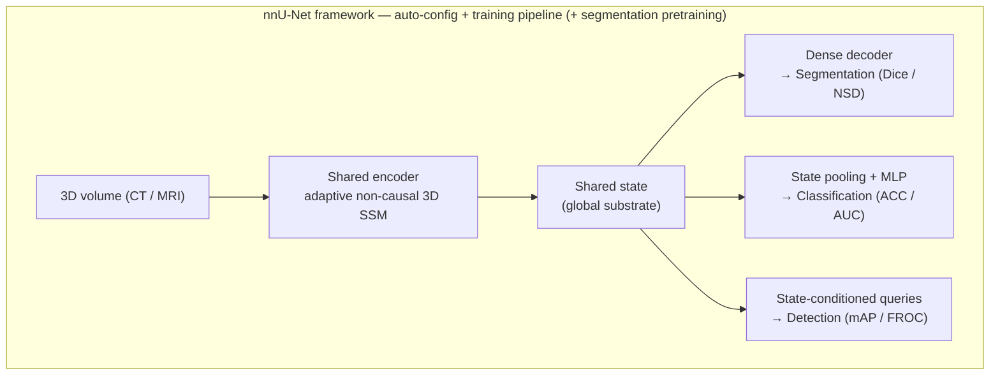
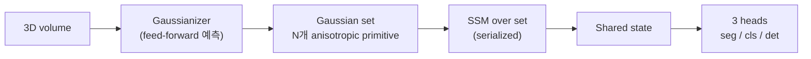

# S³-Net: 공유 상태 기반 적응형 멀티태스크 State-Space 아키텍처

> **Working title (placeholder)** — Shared-State · Saliency-driven · State-space Network.
> 자유롭게 rename. 핵심 아이디어 두 개(② 공유 state substrate, ④ saliency 공유 적응 연산)와 백본(SSM)을 묶은 이름.

3D 의료영상에서 **분할(segmentation)·분류(classification)·검출(detection)** 세 태스크를 하나의 공유 SSM 백본으로 처리하되, **정확도 SOTA · 효율/경량 · 장거리/전역 모델링**을 동시에 노리는 아키텍처 설계안.

---

## 1. 동기 (Motivation)

의료영상 분할의 사실상 표준인 nnU-Net은 "새 아키텍처"가 아니라 **데이터셋에 맞춰 전처리·네트워크 토폴로지·학습·후처리를 자동 설정하는 파이프라인**이다. 그 통찰은 역설적으로 "아키텍처를 바꾸는 것보다 세심한 구현과 설정이 SOTA에 더 결정적"이라는 것이었다. 백본은 바닐라 CNN U-Net이라 **전역/장거리 의존성**을 못 잡고, **분할 단일 태스크**에 묶여 있다.

nnMamba는 CNN의 지역 표현력에 SSM(Mamba)의 선형 복잡도 장거리 모델링을 결합해 이 두 한계를 부분적으로 메웠다(MICCSS 블록, 분할+분류+검출 멀티태스크, 경량 ~15.5M 파라미터). 그러나 (a) 1D 인과 스캔이 3D 공간 구조를 깨고, (b) 장거리 망각(memory decay)이 있으며, (c) 학습 불안정성이 있고, (d) 무엇보다 *nnU-Net Revisited*(MICCAI 2024)가 보였듯 **잘 스케일링된 ResEnc nnU-Net을 순수 정확도에서 이기기 어렵다**.

### 설계 제약 (우리가 택한 것)

- **태스크**: 멀티태스크 — 분할 + 분류 + 검출
- **이기고 싶은 축**: 정확도 SOTA + 효율/경량 + 장거리/전역 표현 (동시에)
- **컴퓨팅**: 멀티 GPU / 클러스터 (→ 강한 baseline·대형 백본·사전학습이 모두 가능)

---

## 2. 배경: nnU-Net vs nnMamba

| 차원 | nnU-Net | nnMamba |
|---|---|---|
| 본질 | 자동 설정 파이프라인 | 백본 아키텍처 (+ nnU-Net 파이프라인 차용) |
| 핵심 기여 | dataset fingerprint 기반 자동 구성 | MICCSS 블록 (Mamba-In-Conv + Channel-Spatial Siamese) |
| 백본 | 바닐라 CNN U-Net (2D/3D/cascade) | CNN + SSM 하이브리드 |
| 장거리 모델링 | 제한된 receptive field | SSM 기반 long-range |
| 대상 태스크 | 분할 중심 | 분할·분류·랜드마크 검출 |
| 효율성 | 표준 conv (배포 쉬움) | 경량 (~15.5M 파라미터) |
| 검증 성숙도 | 매우 높음 (강력한 baseline) | 우월성 주장 일부가 엄밀 벤치마크에서 미성립 |

**핵심**: 두 시스템은 *층위*가 다르다. nnU-Net = 프레임워크, nnMamba = 백본(그 프레임워크 위에 얹힘). 우리는 **프레임워크는 nnU-Net을 그대로 상속**하고 **백본·헤드·연산 정책을 새로 설계**한다.

---

## 3. 설계 개요 (Design Overview)

### Thesis

> 비싼 백본은 하나만 두고, **SSM의 hidden state 자체를 세 태스크가 공유하는 표현(substrate)** 으로 재사용한다.
> dense readout → 분할, pooled state → 분류, state-conditioned query → 검출.

### 아키텍처

- **공유 백본(teal)**: 인코더 + state. 연산의 대부분이 여기 모임 → 세 태스크가 공유하므로 파라미터/연산 효율이 큼.
- **태스크 헤드(coral)**: 경량. 같은 state를 *세 가지 방식으로 읽는다*.
- 전체가 nnU-Net 프레임워크 안에 들어가 자동 설정·전처리·sliding-window 추론·5-fold 등을 상속.

---

## 4. 핵심 기여 (Contributions)

### ① Adaptive non-causal 3D scan
nnMamba의 가장 근본적 약점은 3D 볼륨을 고정 raster로 1D화하면서 공간 인접성을 깨는 것. 두 가지를 바꾼다.
- **Content-adaptive scan**: 해부학/saliency를 따라 스캔 경로를 휘게 함 (라우팅 또는 deformable offset).
- **Non-causal**: 인과성을 버리고 양방향 state 집계.

선례: VSSD(non-causal State Space Duality + multi-scan), Mamba2D(native multi-dimensional SSM), AdaptScanDet(의료 병변 검출용 deformable mamba). 이를 **통합 3D 멀티태스크 백본** 수준으로 끌어올리는 것이 novelty.

### ② State-as-substrate 멀티태스크 헤드
nnMamba는 태스크마다 별도 설계를 덧붙였지만, 여기서는 **SSM hidden state가 곧 압축된 전역 표현**이라는 점을 직접 활용한다.
- 분할: dense per-voxel readout
- 분류: state global pooling + MLP
- 검출: state로 조건화한 DETR식 query head

"하나의 state, 세 가지 읽기"라는 단일 서사 → 개념적 간결함 + 파라미터 효율.

### ③ Anti-forgetting multi-scale state
SSM 순환 구조의 long-range forgetting(시퀀스가 길수록 이전 hidden state 영향 감쇠)을 보완. multi-scale state 재주입 / 계층적 state / register token 등으로 **큰 볼륨에서도 장거리 주장이 깨지지 않게** 한다.

### ④ Saliency-shared adaptive computation ("덜 보기")
현재 파이프라인은 전체를 한 번에 보지 않고 **패치 기반 sliding window**로 본다. 그래서 (a) 배경에 연산을 낭비하고 (b) 추론 시 장거리가 패치 한 칸에 갇힌다. 줄이는 세 축:
- **공간(어디를)**: cheap localizer로 ROI 먼저 → 비싼 백본은 거기만. 스캔을 휘게 하는 걸 넘어 배경 voxel을 *건너뛰는* sparse scan. (선례: EfficientVMamba의 atrous skip sampling)
- **해상도(얼마나 자세히)**: 단순/배경은 저해상, 복잡/foreground만 고해상. (선례: MambaScope — coarse 추론 후 확신 낮은 영역만 refine)
- 핵심: 스캔 경로 학습 = 이미 "어디가 중요한가(saliency)" 추정 → **그 한 번의 신호를 스캔 순서 + 희소화 + 해상도 할당에 모두 재사용**. ①과 한 몸이 되는 것이 우아한 지점.

> **주의(Mamba 특유)**: 토큰을 *버리는* pruning은 Mamba에서 ViT보다 더 위험하다(순차·순서 의존적이라 informative token 손실이 큼). 따라서 hard pruning보다 **merging / 해상도 기반 coarse-to-fine**이 안전. (선례: DyVM은 merge 기반으로 35% FLOPs↓·1.7% 정확도 손실)

### ⑤ Provably near-optimal online state-cache quantization (TurboQuant 영감)
Mamba에서 가장 큰 메모리는 가중치가 아니라 **state 캐시**(state는 일반 activation보다 N배 크고, 큰 배치에서 메모리의 ~80%를 차지하며 **N 확대를 막음**). 그런데 **N↑ = 장거리 용량↑**. 따라서 state 캐시 양자화는 *효율*과 *장거리*를 한 수에 산다.
- TurboQuant의 강점: 증명된 near-optimal 왜곡 + **무보정(online/data-oblivious)** + 편향 없는 내적(QJL). 후자는 ②의 검출 query head 내적 스코어링에 그대로 대응.
- **함정**: TurboQuant 회전을 그대로 쓰면 Mamba에서 깨진다 (QuaRot가 vision Mamba에서 W8A8에도 ~21% 하락; parallel scan이 outlier 증폭; SSM 입력이 양자화에 가장 민감해 naive 8-bit는 붕괴). MambaQuant가 KLT 기반 variance-aligned 회전을, OuroMamba가 per-timestep 동적 outlier 검출을 쓰는 이유.
- **novelty 빈틈**: "Mamba 양자화" 자체는 붐비는 동네(MambaQuant·Quamba·Q-Mamba·OuroMamba·Q-MambaIR). TurboQuant *만* 가진 (증명된 near-optimal + 무보정 + unbiased 내적)을 **3D 의료 스캔의 동적 outlier 환경 + variance-aligned 회전**과 결합해 "무보정 state-cache 양자화 → 더 큰 N → 더 긴 장거리"로 묶으면, 핵심 아키텍처가 아닌 **방어 가능한 효율 레이어**가 된다.
- 본질상 *추론/배포* 레버. 학습 중 N 확대에 쓰려면 QAT식 적응 필요.

---

## 4′. Gaussian/Primitive 표현 — 급진 대안 front-end (GS·4DGS 영감)

④를 표현 차원의 극단까지 밀면 GS(3D Gaussian Splatting)에 닿는다: **균일 dense voxel 격자를, 내용에 따라 밀도가 달라지는 sparse anisotropic primitive(Gaussian) 집합으로 대체**한다. voxel 격자 + scan 대신 볼륨을 N개 Gaussian으로 표현하고 SSM을 **Gaussian 집합 위에서** 돌린다 (N ≪ voxel 수).

**왜 매력적인가 (세 목표 동시 타격)**
- **효율**: 시퀀스가 수백만 voxel → 수백~수천 Gaussian으로 급감. ④를 표현 차원에서 native하게 실현.
- **장거리**: 짧은 집합엔 패치 감옥이 없음 → 1-pass 전역 컨텍스트; ③(망각)도 거의 무력화.
- **기하/정확도**: Gaussian 공분산(scale+rotation)이 혈관·길쭉한 병변의 **방향성 국소 기하**를 인코딩 — raster scan이 부수는 정보를 보존(①의 동기 직접 해결).
- **scan(①) 재정의**: 격자 펴기 대신 Gaussian 중심 space-filling 정렬(point-cloud Mamba식 serialization)이 더 자연스러움.

**②와의 결합 (자연스러운 통일)**
각 Gaussian이 per-primitive feature를 들면 → 그 자체가 공유 substrate. 전체 pooling → 분류; **각 Gaussian의 위치+크기 = 검출의 자연 proposal/query**. 세 헤드가 Gaussian 집합 하나로 통일된다.

**문헌 현실 (정직)**
- 의료 GS는 거의 *복원/표면/보간*이고 대부분 **per-scene 최적화**(MedGS ~20분/객체; Gaussian 파라미터를 독립 변수로 최적화해 전역 제약 부재 → sparse slice에서 구조·의미 불안정). 단, MedGS가 *보간+분할을 통일 기하로* 멀티태스크화한 점은 ②와 공명.
- 핵심 다리는 비의료의 **feed-forward semantic Gaussian**(SemGS·SegSplat·GS4): per-scene 최적화 없이 단일 forward로 semantic feature를 단 Gaussian 예측. SegSplat의 *compact memory bank + discrete index*는 ⑤와도 연결. 단 이들은 multi-view RGB+depth(cost-volume) 기반 → 우리는 *볼륨이 이미 3D라 Gaussian을 볼륨에서 직접 예측*(오히려 단순).

**4DGS → 종단/동적 의료**
4DGS의 deformation field(Deformable3DGS·4D-RotorGS)는 4D-CT/MRI·DCE·perfusion, 그리고 **종단 환자 시계열**에 대응. nnMamba의 ADNI sMCI→pMCI는 본질이 *진행 예측*이라, Gaussian 위 deformation으로 시점 간 해부 변화를 모델링하면 원리적 progression 표현이 된다(분류/진행 헤드의 무기).

**정직한 함정 / 포지셔닝**
- GS의 native 목적은 *렌더링/복원*이지 판별이 아님 → 가져올 핵심은 *표현*(적응형 anisotropic primitive) + *feed-forward semantic-Gaussian* 트릭이지 렌더링 손실 자체가 아님. 판별엔 렌더링이 불필요할 수 있고, 복원 손실은 **보조 정규화**(데이터효율↑)로만 둘 수 있음.
- 저대비 연조직 경계 표현력 미지수, densification/pruning 불안정, 작은 병변 Gaussian 미드롭 위험(④ recall-safe와 동일).
- ①–⑤보다 **훨씬 큰 베팅** → 드롭인 아님. **대안 front-end / 급진 variant(④′)**로 자리매김.

**추진 옵션 (택1 또는 단계적)**
- (a) **급진 front-end**: Gaussian 토큰화 → SSM을 본 백본으로. (고위험·고보상)
- (b) **보조 손실 먼저**: voxel 백본 위에 self-supervised 복원 손실로 얹어 데이터효율부터 확보, 유망하면 (a)로 승격. (권장 시작점)
- (c) **4DGS 집중**: sMCI→pMCI 진행 모델에 deformation 표현만 우선 적용.

---

## 5. 목표 → 기여 매핑

| 목표 (선택) | 어디서 오는가 | 정직한 메모 |
|---|---|---|
| **장거리·전역** | ① 적응형 스캔 + ③ 망각 방지 + ⑤ N 확대 | SSM 선형 복잡도가 큰 볼륨을 감당; 패치 천장은 ④의 coarse global pass로 완화 |
| **효율·경량** | ② 백본 공유(3 모델 → 1) + ④ 덜 보기 + ⑤ 비트폭↓ | FLOPs 이득과 wall-clock 이득은 다를 수 있음(커널 이슈) |
| **정확도 SOTA** | 분할 사전학습(SuPreM류) + 백본 스케일링(클러스터) | 아키텍처만으로 스케일링된 ResEnc nnU-Net을 이기긴 어려움. 현실적 승리 = **Pareto(동일 정확도·저비용) + 멀티태스크 통합** |

> ④′(Gaussian 토큰화)를 채택하면 세 목표를 표현 차원에서 동시에 강화 — §4′ 참조.

---

## 6. 효율성의 세 직교 축

세 축은 서로 곱해진다(orthogonal & composable):

1. **공간 희소화** — 몇 개의 voxel을 보는가 (④)
2. **해상도** — 얼마나 자세히 보는가 (④)
3. **비트폭** — 각 표현을 몇 비트로 저장/연산하는가 (⑤)

①의 saliency 신호가 1·2를, ⑤가 3을 담당. state 캐시가 비트폭 축의 최대 병목.

> **급진 버전(④′)**: Gaussian 토큰화는 1·2축(어디를·얼마나)을 격자 대신 *primitive 밀도/공분산*으로 한꺼번에 실현.

---

## 7. 학습 전략 (Training)

- **프레임워크 상속**: 백본을 nnU-Net의 ResEnc 드롭인으로 구현 → 자동 설정·전처리·sliding window·5-fold·ensembling을 그대로 사용. (검증 비교가 공정해짐)
- **사전학습**: 분할 사전학습 인코더(SuPreM류)로 정확도·데이터효율 확보. self-supervised보다 segmentation pretraining이 전이에 유리하다는 보고와 정합.
- **멀티태스크 밸런싱**: 음의 전이 대비 — uncertainty weighting / gradient surgery(PCGrad) / task-specific adapter.
- **컴퓨팅**: 멀티 GPU/클러스터 → 대형 백본 + 강한 baseline 재현 + 사전학습 모두 수행.

---

## 8. 평가 계획 (Evaluation)

*nnU-Net Revisited* 가이드라인 준수 (적절한 baseline · 충분한 데이터셋 · 연산 통제). **검증 설계 = 곧 기여.**

- **Baselines**: 스케일링된 ResEnc nnU-Net(가장 강함), nnMamba, U-Mamba, SegMamba, Transformer(SwinUNETR / nnFormer).
- **데이터셋 (멀티태스크라 셋 다 커버)**:
  - 분할: BraTS2023, AMOS22, (+ MSD / KiTS)
  - 분류: ADNI (NC vs AD, sMCI vs pMCI)
  - 검출: LUNA16 / DeepLesion 등 (3D 검출은 희소 — 가장 위험)
- **지표**: Dice·NSD·HD95(분할), ACC·AUC·F1(분류), mAP·FROC(검출), **+ FLOPs·params·latency·peak memory**(효율 주장 필수).
- **Ablation**:
  - 스캔: 고정 raster vs 적응형 vs non-causal (①)
  - state 공유 vs 분리 헤드 (②)
  - 망각 방지 on/off (③)
  - 적응 연산(희소화·해상도) on/off, recall-safe scoping (④)
  - 양자화 비트폭 스윕, 회전 방식 (⑤)
  - 사전학습 on/off, 태스크 밸런싱 방법

---

## 9. 리스크 & 완화 (Risks & Mitigations)

| 리스크 | 완화 |
|---|---|
| **음의 전이** (세 태스크가 서로 싸움) | uncertainty weighting, gradient surgery, task adapter; 헤드를 하나씩 추가하며 관찰 |
| **3D 검출 데이터 희소** | 분할+분류 먼저, 검출 헤드 마지막; weak/synthetic label; FROC 사용 |
| **커스텀 CUDA 커널** (scan + sparse + quant) → 이식성·wall-clock | 조기 프로파일링; Triton 고려; FLOPs↔latency 괴리 보고 |
| **SSM 양자화 취약성** (2–4bit 붕괴, 동적 outlier) | mixed precision (SSM hot path 고정밀), variance-aligned 회전, per-timestep outlier 검출 |
| **작은 병변 누락** (희소화/coarse-to-fine 부작용) | recall-safe scoping; confidence-driven refine; foreground 후보 절대 미드롭 |
| **패치 천장** (장거리가 패치 크기에 갇힘) | coarse global pass + sparse high-res ("패치 감옥 깨기") |
| **검증 비판** (Revisited식) | 스케일링 ResEnc baseline, 충분한 데이터셋, 연산 통제, 공정 비교 |
| **(④′) GS 판별 적합성 미지수** (저대비 연조직 경계) | 복원을 *보조 손실*로만; voxel 백본과 하이브리드 검증부터 |
| **(④′) Gaussian densify/prune 불안정** | 작은 병변 Gaussian 미드롭(recall-safe); 안정적 densify 스케줄 |

---

## 10. 개발 로드맵 (Phased Build)

리스크가 낮은 순서로 단계화:

0. **Phase 0** — 스케일링된 ResEnc nnU-Net baseline을 선정 분할 데이터셋에서 재현 (잔인한 baseline 확보).
1. **Phase 1** — ① 적응형 non-causal 스캔을 nnU-Net 드롭인 백본으로, **분할 단일 태스크**에서 baseline 동급 달성.
2. **Phase 2** — ② 공유 state + 분류 헤드 추가, 음의 전이 측정.
3. **Phase 3** — 검출 query 헤드 추가.
4. **Phase 4** — ③ 망각 방지(대형 볼륨 장거리 검증).
5. **Phase 5** — ④ saliency 공유 적응 연산(희소화 + 해상도).
6. **Phase 6** — ⑤ state-cache 양자화(배포/추론 효율).

전 과정: 분할 사전학습 + ablation 동반.

**Track B (병렬·탐색, ④′)** — Gaussian 토큰화 front-end: 우선 voxel 백본 위 *보조 self-supervised 복원 손실*로 검증(옵션 b) → 유망하면 Gaussian-native front-end로 승격(옵션 a). 4DGS deformation은 sMCI→pMCI 진행 모델에 별도 실험(옵션 c).

---

## 10′. 단계별 실험 검증 프로토콜 (Phase Validation Gates)

각 Phase는 **사전 등록된 성공/중단 게이트**를 갖는다 — 통과해야 다음 단계로(post-hoc 합리화 방지). 원칙은 *nnU-Net Revisited* 그대로: 적절한 baseline(스케일링 ResEnc) · 충분한 데이터셋 · 연산 통제. 모든 비교는 동일 전처리·split·compute에서, **정확도와 함께 GPU-hours·params·FLOPs·latency·peak memory를 항상 같이 보고**. ablation은 한 번에 한 변수, compute-matched. 통계는 케이스/fold 단위 paired test + bootstrap CI + 다중 seed 분산. 가능하면 **외부(타 기관/스캐너) 테스트셋**으로 일반화까지 확인.

### Phase 0 — Baseline 재현
- **가설**: 스케일링 ResEnc nnU-Net(+ nnMamba/U-Mamba/SegMamba)을 우리 harness에서 공정·재현 가능; baseline이 강하고 안정적.
- **실험**: 각 seg 데이터셋 5-fold로 보고치 재현; 동일 파이프라인·compute로 모든 baseline 재학습; eval harness(전처리·split·TTA) **동결**.
- **게이트**: Dice/NSD가 보고치 ±~1% 이내, fold 간 분산 낮음; compute 레퍼런스 기록.
- **위험 신호**: 재현 실패 → harness 오류(무엇보다 먼저 수정); baseline이 의심스럽게 낮으면 *우리가* Revisited 비판 대상.

### Phase 1 — ① 적응형 비인과 스캔 (seg 단독)
- **가설**: 적응형+비인과 스캔 > 고정 raster, 그리고 동일 compute에서 ResEnc nnU-Net 동급 이상 — 이득이 *스캔 때문*(파라미터 증가 아님).
- **핵심 ablation(사다리)**: (1) raster → (2) bi/multi-scan → (3) non-causal → (4) +content-adaptive(full ①), 전부 params/FLOPs 매칭.
- **부가 검증**: ERF(effective receptive field) 측정으로 CNN보다 긴 범위 포착 입증; 길쭉한/큰 구조 subgroup에서 이득 더 큼; 학습 안정성(gradient norm, skip-scaling 필요성) ablation; 학습된 스캔 경로가 실제 해부를 따르는지 시각화 + seed 안정성.
- **게이트**: ① > raster (paired test/CI 유의) **그리고** Dice-vs-compute **Pareto front** 위.
- **위험 신호**: ①이 raster와 동급(복잡도 무가치) / 스케일링 ResEnc 대비 이득 소멸(make-or-break) / 학습 불안정.

### Phase 2 — ② 공유 state + 분류 헤드
- **가설**: seg+cls 공유 백본이 (a) seg를 Phase-1 대비 안 떨어뜨리고 (b) pooled state가 전용 분류기 동급 → "3→1"의 2-태스크 버전 성립, 음의 전이 없음.
- **핵심 ablation**: 음의 전이(seg-only vs seg+cls Δ); 밸런싱(equal vs uncertainty vs PCGrad); state 공유 방식(완전 공유 vs task projection vs 분리 헤드); state를 읽는 깊이/pooling.
- **데이터셋**: seg + ADNI(NC/AD, sMCI/pMCI).
- **게이트**: seg Dice 하락 ≤ε(예: 0.5%p), cls ACC/AUC ≥ 전용 baseline, 합산 params/FLOPs < (seg+cls 개별 합).
- **위험 신호**: cls 추가 시 seg 유의 하락(전이 통제 불가) / cls가 분리 헤드에서만 됨(substrate 논리 약화).

### Phase 3 — 검출 query 헤드
- **가설**: state-조건 query가 전용 3D 검출기 동급 검출을 주면서 백본 공유 유지(3태스크 1백본), seg/cls 안 깨짐. 추가로 **seg 사전학습 백본이 저데이터 검출을 돕는** 시너지.
- **핵심 ablation**: 3태스크 간섭(seg/cls/det Δ); query 수·초기화(learned vs state-유래 vs Gaussian-유래)·매칭(Hungarian); 저라벨 검출에서 멀티태스크 이득.
- **데이터셋**: + LUNA16 / DeepLesion(검출 희소 — 최대 위험).
- **게이트**: mAP/FROC ≥ 전용 검출기(또는 허용 오차) at 더 낮은 총비용; seg/cls 비열화; 저데이터 시너지 입증 시 강한 셀링포인트.
- **위험 신호**: 검출이 전용 대비 크게 낮음 / 3중 간섭 통제 불가 / 데이터가 너무 적어 결론 불가.

### Phase 4 — ③ 망각 방지 (대형 볼륨)
- **가설**: multi-scale state 재주입이 long-range forgetting을 실제로 완화 → **큰 볼륨/긴 시퀀스에서** 정확도 향상, 장거리 주장을 스케일에서 입증.
- **핵심 실험**: 시퀀스 길이/볼륨 크기 sweep — ③ on/off 격차가 **길이에 따라 벌어져야** 함(이게 증명); 공간 needle-in-haystack류 합성 long-range probe로 원거리 의존 회수 측정; 메커니즘 구성요소(재주입/계층 state/register token) ablation; ③ 오버헤드(params/FLOPs/mem) 대비 이득.
- **데이터셋**: whole-volume(공격적 패치 없이) 대형 CT(AMOS full) + 합성 probe.
- **게이트**: 대형 볼륨에서 ③ > no-③ 유의, 크기 따라 격차 증가; 합성 probe 회수 입증; 오버헤드 수용 가능.
- **위험 신호**: 이득 없음(forgetting이 병목 아니었거나 메커니즘 무력) / 합성에서만 되고 실데이터 X.

### Phase 5 — ④ saliency 공유 적응 연산 (희소화 + 해상도)
- **가설**: 배경 skip + 적응 해상도가 정확도 거의 손실 없이 연산 크게 절감, **그리고 작은 병변을 안 놓침(recall-safe)**; 공유 saliency 하나가 scan+희소화+해상도를 충돌 없이 구동.
- **핵심 실험**: compute–accuracy trade-off 곡선(예산 sweep, knee 탐색); **소병변 recall/민감도@고정FPR이 dense 대비 비열등(non-inferiority)** — 크기별 subgroup·소병변 FROC; pruning vs merging vs coarse-to-fine(Mamba 특유 pruning 열위 실증 → 안전 연산 선택); 공유 saliency vs 분리 신호; confidence-driven refine 효과.
- **게이트**: 예) FLOPs/latency ≥X% 절감 at 정확도 하락 ≤ε; **소병변 recall ≥ dense(비열등)**; 공유 saliency ≈ 분리.
- **위험 신호**: 소병변 recall 하락(임상 no-go) / pruning이 Mamba 불안정화(→merging) / FLOPs는 줄지만 wall-clock 이득 없음(커널).

### Phase 6 — ⑤ state-cache 양자화 (배포)
- **가설**: state-cache(및 feature) 양자화가 정확도 손실 한정으로 메모리/throughput 이득 → 더 큰 N(장거리)·큰 배치를 가능케 하고, unbiased 내적이 검출 스코어를 보존.
- **핵심 실험**: 비트폭 sweep(정확도-vs-bit, near-neutral 탐색); 회전 ablation(plain/Hadamard vs variance-aligned KLT식 — plain이 우리 Mamba에서 깨짐을 실증하고 해법 검증); per-timestep 동적 outlier(OuroMamba식) 필요성; mixed precision(SSM hot path 고정밀 + cached state 저비트); **"unlock N" 테스트**(양자화로 N↑ → 장거리/정확도 향상되는가); 검출 mAP 내적 충실도; 타깃 하드웨어 wall-clock·메모리(실측).
- **게이트**: 예) state-cache ≥4× 압축 at 전 태스크 정확도 하락 ≤ε; 검출 mAP 보존; 큰-N 변형이 정확도 이득; 실제 메모리/throughput 개선.
- **위험 신호**: 타깃 비트에서 SSM 붕괴(→hot path 정밀도↑) / 검출 mAP 하락(내적 편향) / 실 wall-clock·메모리 이득 없음.

### Track B — ④′ Gaussian (병렬·kill-fast 게이트)
탐색 트랙이라 SOTA가 아니라 **빠른 타당성 게이트**로 운영.
- **B0 표현 충실도**: N≪voxel개 Gaussian이 의료 볼륨을 수용 가능한 충실도로 표현하는가?(N별 PSNR/SSIM, mask Dice) → 연조직 표현 가능성 판단.
- **B1 보조 손실(옵션 b)**: voxel 백본에 Gaussian 복원을 self-supervised 보조 손실로 → 저라벨 정확도 향상? **게이트: 저데이터 Dice 개선.**
- **B2 feed-forward 예측**: 볼륨에서 1-pass로 Gaussian 예측 가능?(per-scene MedGS식 대비 속도·충실도).
- **B3 Gaussian-native front-end(옵션 a)**: SSM-over-Gaussian vs voxel 백본 Pareto; 짧은-시퀀스 효율이 정확도 손실 없이 실현되는가; 소병변 Gaussian 밀도(recall).
- **B4 4DGS/종단(옵션 c)**: ADNI 종단에서 Gaussian-deformation 진행 표현이 단일시점 분류보다 sMCI→pMCI를 개선?
- **승격 결정**: B0–B3 통과 시에만 main 승격; 아니면 보조 손실로 유지 또는 폐기.

---

## 11. 관련 연구 & 포지셔닝 (Related Work)

- **프레임워크/baseline**: nnU-Net, *nnU-Net Revisited*.
- **의료 SSM 백본**: nnMamba, U-Mamba, SegMamba, LightM-UNet.
- **스캔/비인과 SSM**: VSSD(non-causal SSD), Mamba2D(native multi-dim), AdaptScanDet(deformable, 의료 검출).
- **적응 연산/토큰 절감**: MambaScope(coarse-to-fine), DyVM, EfficientVMamba, Token Reduction for Vision Mamba (MTR).
- **Mamba 양자화**: MambaQuant, Quamba, Q-Mamba, OuroMamba, Q-MambaIR; **TurboQuant**(VQ, KV/벡터DB; 본 설계 ⑤의 영감).
- **멀티모달/리포트(향후)**: U-VLM(nnU-Net 기반 리포트 생성), VividMed.
- **검출 헤드**: DETR(query 기반).
- **사전학습**: SuPreM(segmentation pretraining 전이 우수).
- **Gaussian 표현(영감, §4′)**: 3DGS(Kerbl 2023), 4DGS·Deformable3DGS·4D-RotorGS; 의료 GS(복원 위주): MedGS(복원+분할 멀티태스크, per-scene), cerebral angiography GS; feed-forward semantic GS: SemGS·SegSplat·GSemSplat·GS4·UniForward; point serialization: PointMamba 계열.

**한 줄 포지셔닝**: "nnU-Net의 검증 엄밀성을 상속한 채, 적응형 비인과 3D SSM 백본 + state-substrate 멀티태스크 + saliency 공유 적응 연산 + 무보정 state 양자화로 *정확도-효율-장거리*의 Pareto를 미는 단일 3D 의료영상 모델."

---

## 12. 미해결 질문 (Open Questions)

- ① 적응형 스캔의 경로를 **어떻게 학습**시킬 것인가 — content-routing vs deformable offset? 미분 가능성/안정성은?
- ② 공유 state를 세 헤드가 읽을 때 **task-specific projection을 얼마나 둘 것인가** (완전 공유 ↔ 분리 사이의 최적점)?
- ④ saliency 신호를 스캔/희소화/해상도가 **공유하되 충돌하지 않게** 만드는 손실 설계는?
- ⑤ state 양자화를 **추론 전용**으로 둘지, QAT로 학습 중 N 확대까지 노릴지?
- 멀티태스크 데이터가 **한 데이터셋에 다 없을 때** (분할/분류/검출이 서로 다른 코호트) 학습·평가 프로토콜은?
- **(④′)** Gaussian을 볼륨에서 feed-forward로 예측할지 per-scene 최적화할지? 렌더링 손실은 보조로만 둘지, 필수일지?
- **(④′)** 저대비 연조직에서 몇 개 Gaussian이 필요하며, 작은 병변을 안 놓치는 densify/recall-safe 정책은?
- **(4DGS)** deformation field를 sMCI→pMCI 진행 예측에 어떻게 결합할지(시점 정합·등록 포함)?

---

## References

> 이 세션에서 확인된 arXiv ID는 함께 표기. ID 없는 항목은 이름/프로젝트로 표기(ID는 추후 확인 권장).

- Isensee et al. **nnU-Net: a self-configuring method for deep learning-based biomedical image segmentation.** *Nature Methods*, 2021.
- **nnU-Net Revisited: A Call for Rigorous Validation in 3D Medical Image Segmentation.** MICCAI 2024. arXiv:2404.09556.
- Gong et al. **nnMamba: 3D Biomedical Image Segmentation, Classification and Landmark Detection with State Space Model.** arXiv:2402.03526.
- Gu & Dao. **Mamba: Linear-Time Sequence Modeling with Selective State Spaces.** arXiv:2312.00752.
- **U-Mamba: Enhancing Long-range Dependency for Biomedical Image Segmentation.** (project: u-mamba.github.io)
- **SegMamba: Long-range Sequential Modeling Mamba for 3D Medical Image Segmentation.**
- **VSSD: Vision Mamba with Non-Causal State Space Duality.**
- **Mamba2D: A Natively Multi-Dimensional State-Space Model for Vision Tasks.** arXiv:2412.16146.
- **AdaptScanDet: Deformable Mamba with Multi-scan Interaction for Heterogeneous Lesion Detection.** (Elsevier)
- **MambaScope: Coarse-to-Fine Scoping for Efficient Vision Mamba.** arXiv:2512.00647.
- **DyVM: Dynamic Vision Mamba.** arXiv:2504.04787.
- **EfficientVMamba** (atrous selective scan / efficient skip sampling).
- **Training-free Token Reduction for Vision Mamba (MTR / R-MeeTo).** arXiv:2507.14042.
- **MambaQuant: Quantizing the Mamba Family with Variance Aligned Rotation Methods.** arXiv:2501.13484.
- **Quamba: A Post-Training Quantization Recipe for Selective State Space Models.** arXiv:2410.13229.
- **OuroMamba: A Data-Free Quantization Framework for Vision Mamba.** arXiv:2503.10959.
- **Q-MambaIR: Accurate Quantized Mamba for Efficient Image Restoration.** arXiv:2503.21970.
- Zandieh et al. **TurboQuant: Online Vector Quantization with Near-optimal Distortion Rate.** arXiv:2504.19874.
- **U-VLM: Hierarchical Vision Language Modeling for Report Generation.** arXiv:2603.00479.
- **VividMed: Vision Language Model with Versatile Visual Grounding for Medicine.** arXiv:2410.12694.
- Carion et al. **End-to-End Object Detection with Transformers (DETR).** ECCV 2020.
- **SuPreM** (supervised segmentation pretraining for transfer).
- Kerbl et al. **3D Gaussian Splatting for Real-Time Radiance Field Rendering.** SIGGRAPH 2023. arXiv:2308.04079.
- **4D Gaussian Splatting** / **Deformable 3D Gaussians** / **4D-RotorGS** (동적·시간 장면).
- **MedGS: Gaussian Splatting for Multi-Modal 3D Medical Imaging.** arXiv:2509.16806.
- **SemGS: Feed-Forward Semantic 3D Gaussian Splatting from Sparse Views.** arXiv:2603.02548.
- **SegSplat: Feed-forward Gaussian Splatting and Open-Set Semantic Segmentation.** arXiv:2511.18386.
- **GSemSplat: Generalizable Semantic 3D Gaussian Splatting.** arXiv:2412.16932.
- **GS4: Generalizable Sparse Splatting Semantic SLAM.** arXiv:2506.06517.
- **PointMamba / Point Cloud Mamba** (point serialization for SSM).

---

*상태: 초안 v0.3 — 단계별 검증 게이트(§10′) 추가. GS/4DGS 영감(④′) 포함. Phase 0(baseline 재현)부터, 각 Phase는 사전 등록된 게이트 통과 시 진행; ④′는 Track B로 병렬 탐색.*